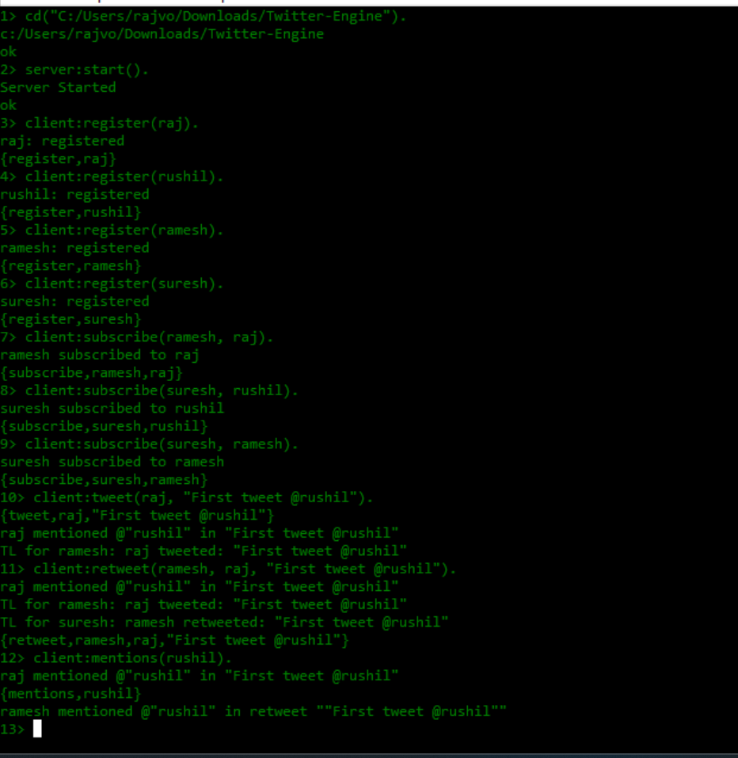
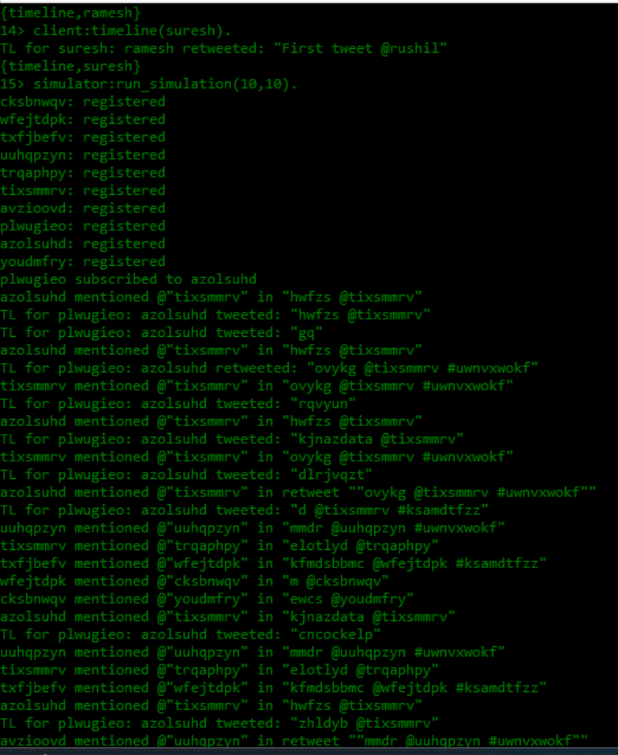
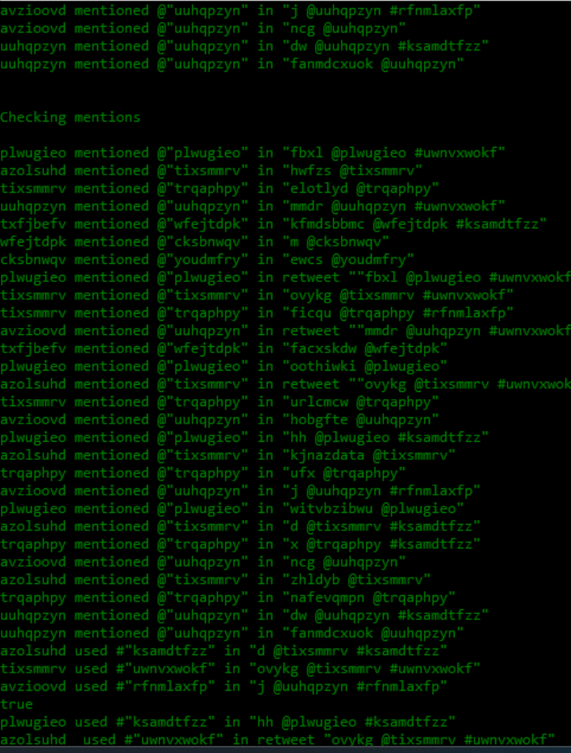
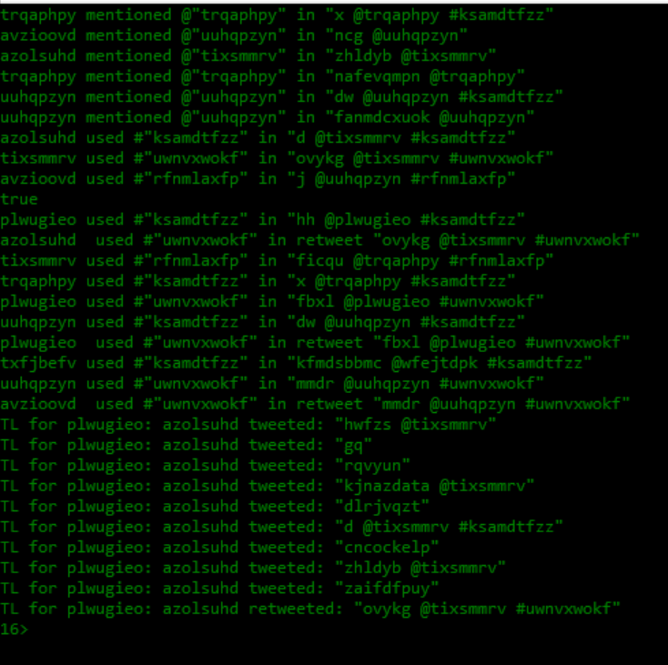
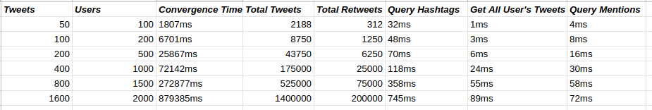
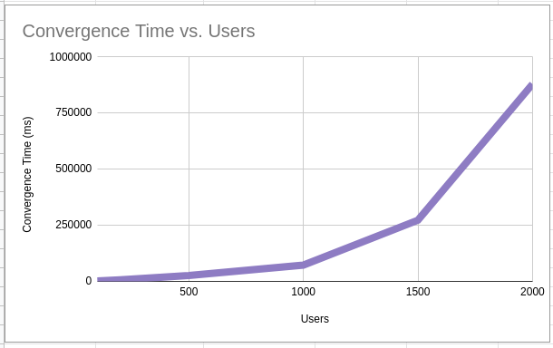
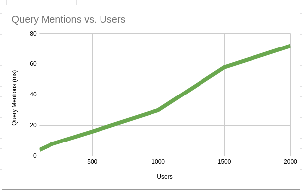
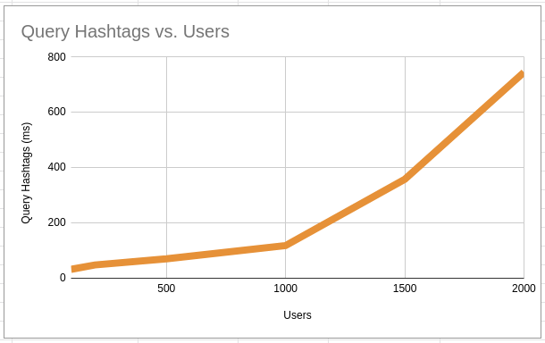
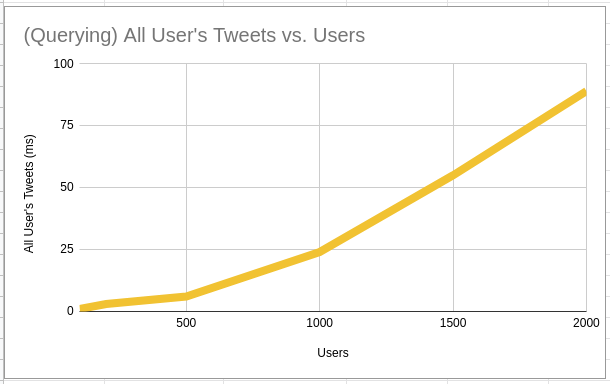

# Project 4

## Contributors
 - Raj Vora, 35551411
 - Rushil Patel, 66999320

## Problem Definition

Implement a Twitter-like engine with the following functionality:

- Register account
- Send tweet. Tweets can have hashtags (e.g. #COP5615isgreat) and mentions (@bestuser)
- Subscribe to user's tweets
- Re-tweets (so that your subscribers get an interesting tweet you got by other means)
- Allow querying tweets subscribed to, tweets with specific hashtags, tweets in which the user is mentioned (my mentions)
- If the user is connected, deliver the above types of tweets live (without querying)

Implement a tester/simulator to test the above

-    Simulate as many users as you can
-    Simulate periods of live connection and disconnection for users
-    Simulate a Zipf distribution on the number of subscribers. For accounts with a lot of subscribers, increase the number of tweets. Make some of these messages re-tweets

## Steps to run

1. Compile all the files to `.beam` with `erlc ./*.erl` command.
2. Then start erlang shell with `.erl`.
3. Start server with command `server:start().`
4. The client has multiple functions for all the above mentioned APIs.
5. Register a user using `client:register(Username)`, the username should be an atom. The user is automatically online when he registers.
6. Then the user can subscriber to another user with the command `client:subscribe(Username, Subscribe_To)` where both usernames have to be atoms.
7. Any user can tweet with the command `client:tweet(Username, Tweet)` where the Tweet is a string and can contain mentions with `@username` and hashtags as `#cop5616isgreat`.
8. User can also retweet another users tweet with `client:retweet(Username, Tweeter, Tweet)`.
9. All these tweets are delivered live to the user if he is online i.e. tweets by users he has subscribed to and tweets in which the given user is mentioned.
10. The user can logout anytime with the command `client:logout(Username)`.
11. We can also query for the subscribed tweets, my mentions and any hashtag with `client:timeline(Username)`, `client:mentions(Username)` and `client:hashtag(Username, Hashtag)`.

## Simulator

- The simulator takes number of users and number of tweets as input with the command `simulator:run_simulation(No_of_users, No_of_tweets)`.
- It then uses the above commands to register and send tweets with the users.
- We follow zipf law for subscribers which asserts that the frequencies f of certain events are inversely proportional to their rank r. Which means the user with highest rank has (0.1 / rank) x total subscribers.
- The highest ranked user also has largest number of tweets and 1/8th of those tweets are retweets.
- Then each users mentions and timelines are queried.
- There is a fix batch of hashtags which is used in various tweets for simulation. That set of hashtags is queried multiple times by random users.
- We could simulate the whole system with a maximum of 2000 users.

## Screenshots

- Direct client usage

- Simulator use

## Graphs

- We plot the time taken for these operations with various number of users and tweets.

